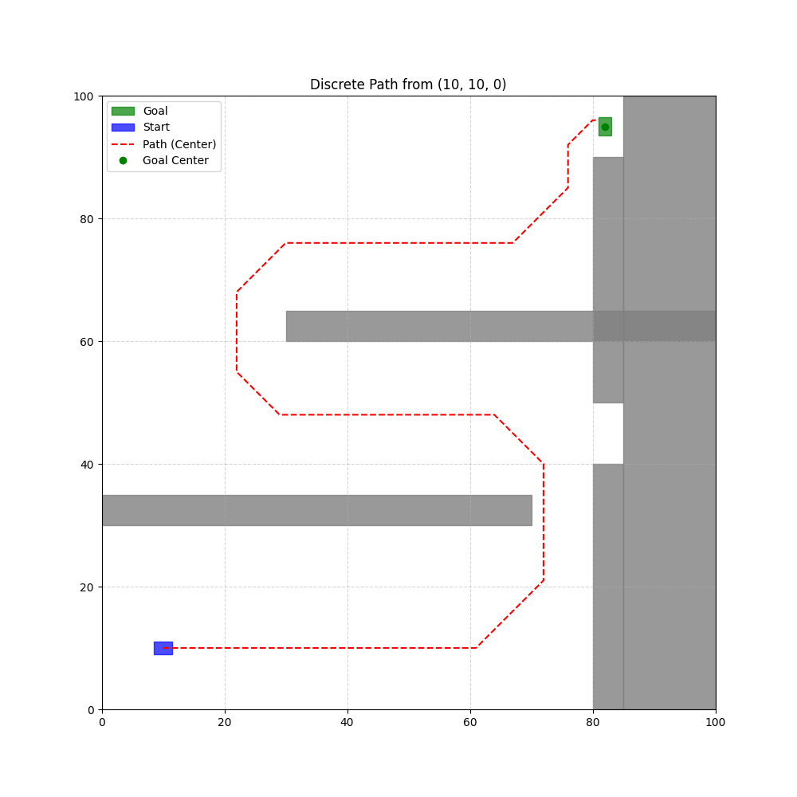
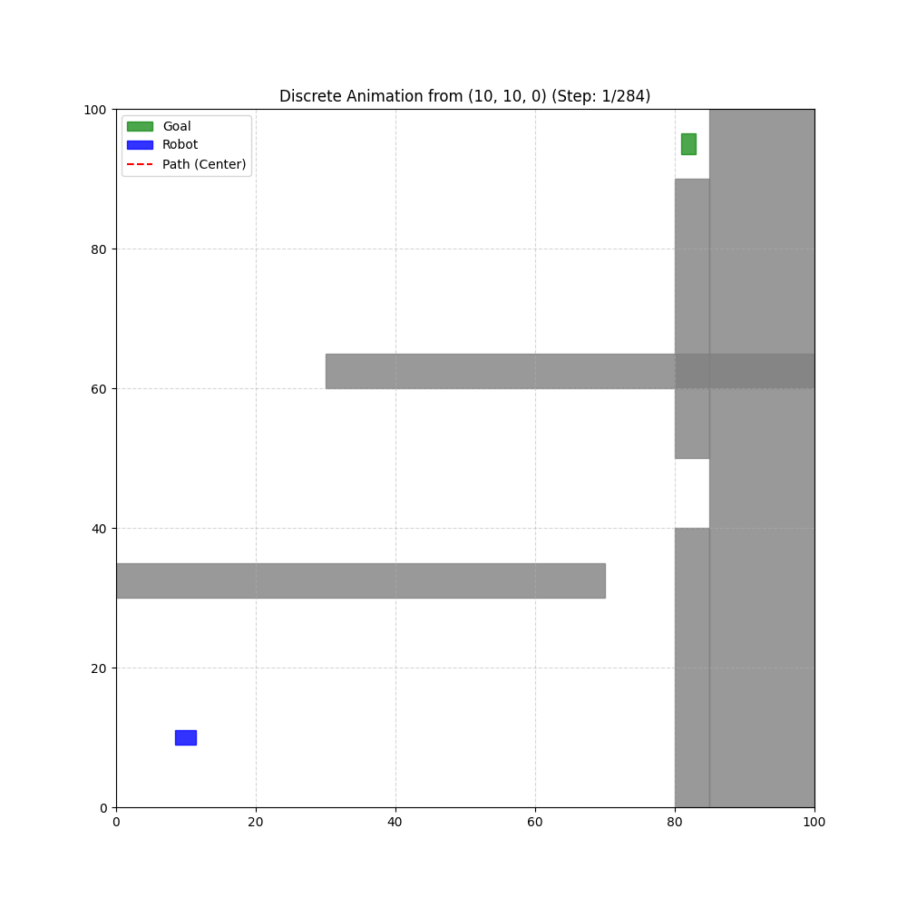
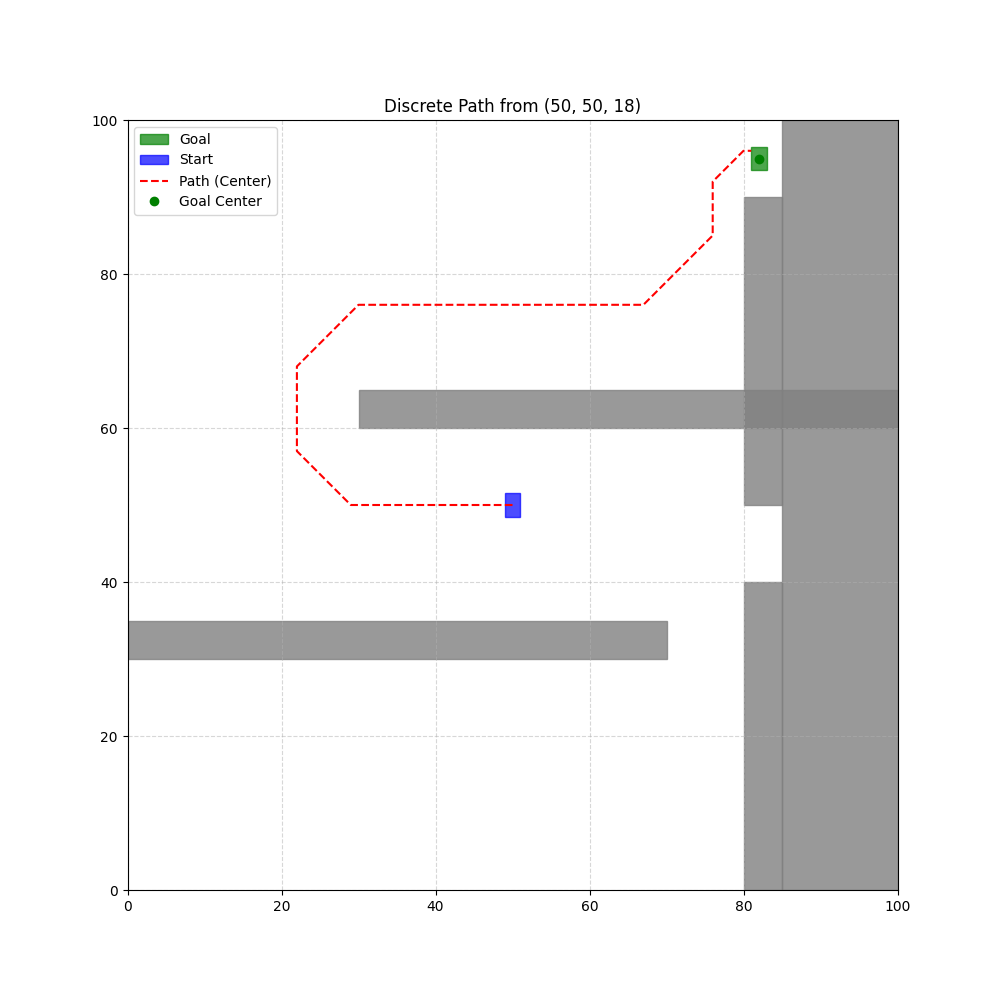
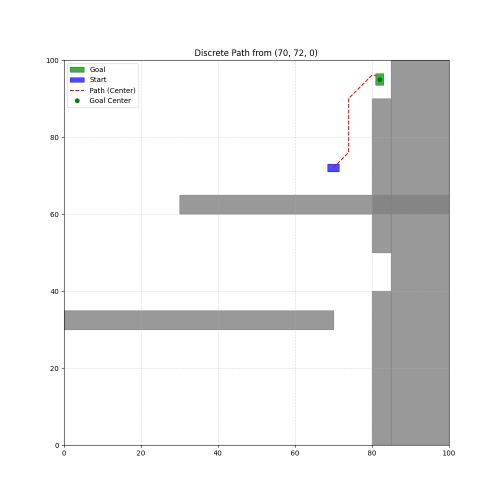
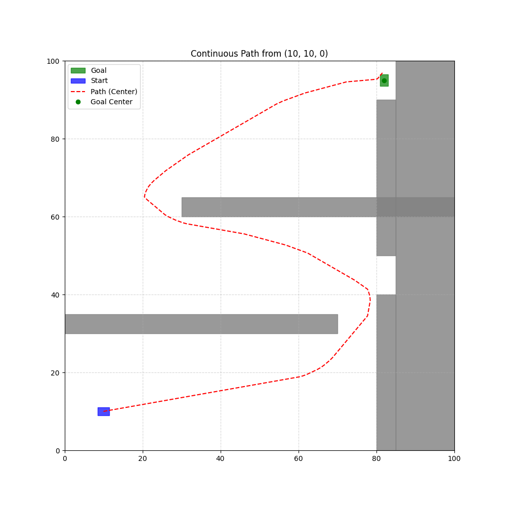
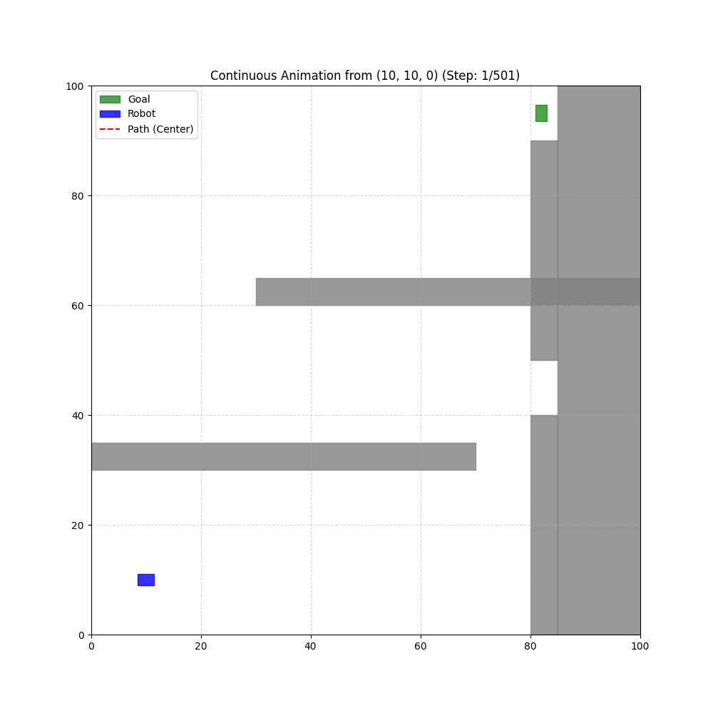
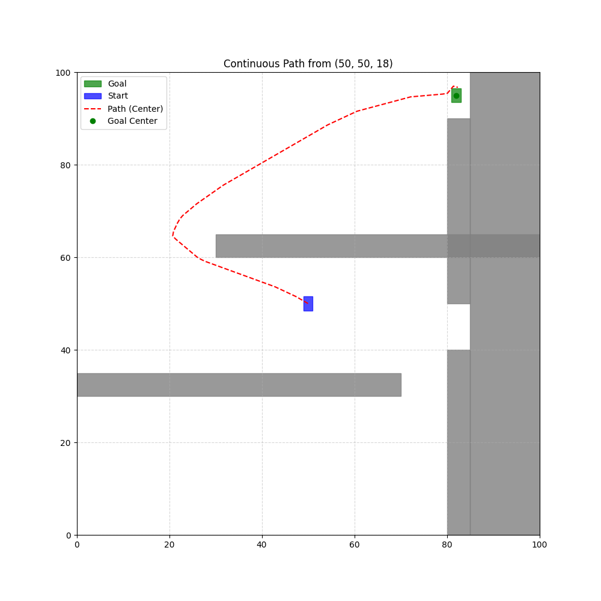
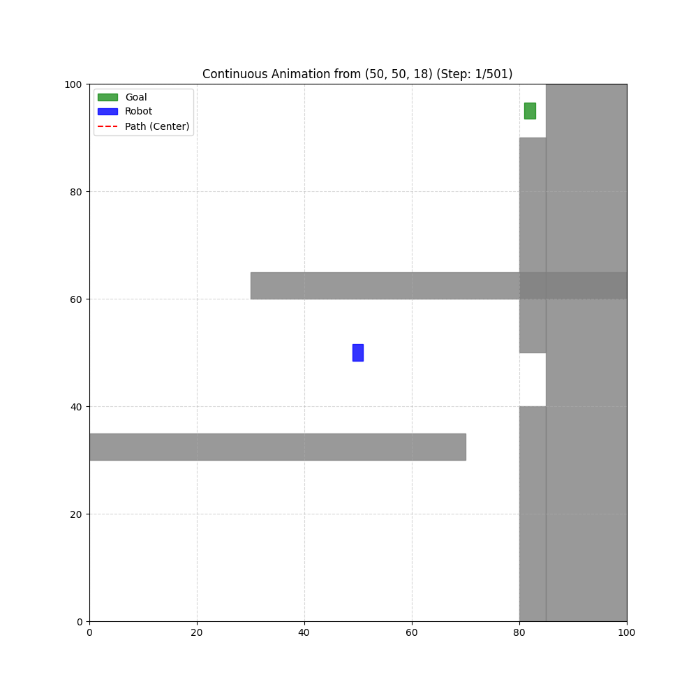
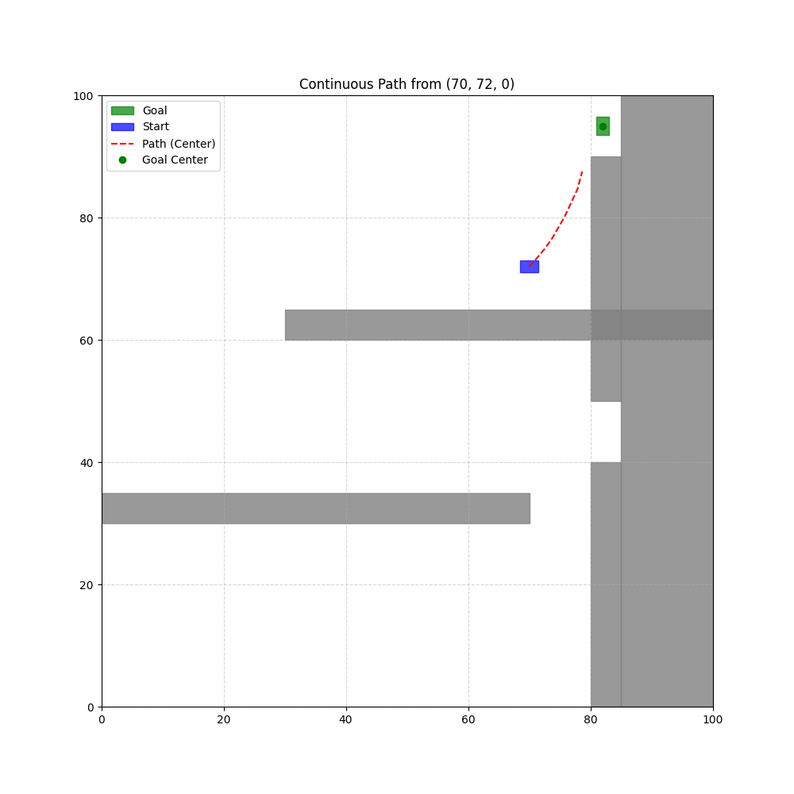
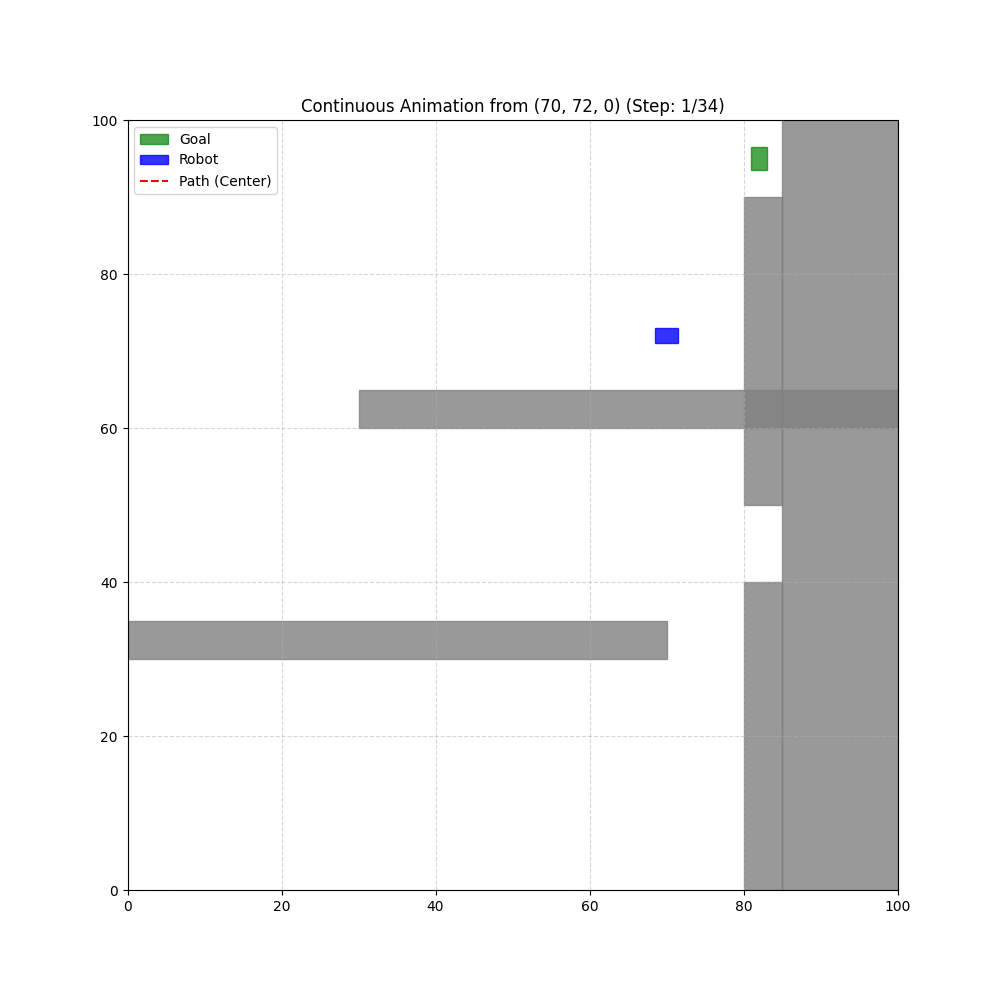

# Autonomous Agent Navigation using Deep Q-Network (DQN)

This project implements an autonomous agent capable of navigating a 2D grid environment with obstacles, using a deep reinforcement learning approach based on **Deep Q-Networks (DQN)**. The agent controls a non-point robot (with physical footprint and orientation) and learns an optimal policy to reach a target position and orientation `(x, y, theta)`, avoiding collisions and respecting movement constraints.

## Key Features

* **Grid Environment:** Discrete `NX x NY` world with polygonal obstacles.
* **Agent State:** The agent uses a **feature-based state representation** including position, orientation, goal direction, and sensor readings.
* **Agent Actions:** The agent has three discrete actions: `TURN_LEFT`, `TURN_RIGHT`, `MOVE_FORWARD`.
* **Continuous Training:** The agent is trained directly in a continuous environment, reducing the sim-to-real gap.
* **Collision Detection:** Uses the `Shapely` library to calculate the exact intersection between the robot's rotated footprint and obstacles, including map boundaries as impassable barriers.
* **Sensor-Based Perception:** The agent uses three simulated distance sensors (front, left, right) to perceive nearby obstacles.
* **Curriculum Learning (Optional):** The agent can be trained progressively by starting from easier initial states (near the goal) and gradually increasing task difficulty.
* **Advanced Reward Shaping:** Uses a system of rewards and penalties to guide learning:
    * `R_GOAL`: Positive reward for reaching the target.
    * `R_COLLISION`: Severe penalty for collisions with obstacles or boundaries.
    * `R_STEP`: Cost for each step to incentivize short paths.
    * `R_ROTATE`: Cost for rotations to avoid unnecessary movements.
    * Distance-based reward: Encourages progress toward the goal.
    * Orientation reward: Encourages alignment with the goal direction.

## Project Structure

    autonomous_agent_pjwk/
    ├── src/
    │   ├── config.py          # Configuration parameters (map, robot, rewards)
    │   ├── environment.py     # World logic, physics, collisions, sensors
    │   ├── dqn_agent.py       # DQN agent implementation
    │   ├── network.py         # Neural network (Q-function approximator)
    │   ├── replay_buffer.py   # Experience replay buffer
    │   ├── visualizer.py      # Functions for generating plots and animations    
    │   └── main.py            # Main script for training and simulation
    ├── README.md              # Project documentation (English Version)
    ├── results/               # Images and animations of multiple experiments
    │   ├── DQN                # DQN results 
    │   └── Value Iteration    # Value Iteration results
    └── requirements.txt       # Python dependencies

## Implementation Details

### 1. Environment and Physics (`src/environment.py`)
The core of the simulation is the `Environment` class, which handles world physics and perception.
* **State:** The internal state is `(x, y, theta_idx)`, but the agent observes a feature vector including normalized position, orientation (`sin/cos`), goal direction, and sensor readings.
* **Transitions:** The `step(state, action)` function applies robot kinematics. Movements can be executed in both discrete and continuous modes.
* **Collisions:** The `is_collision(state)` function uses `Shapely` to compute the exact robot footprint and detect intersections with obstacles or map boundaries.
* **Sensors:** The `get_sensors(state)` function simulates three range sensors by casting rays and detecting obstacle proximity.
* **Continuous Mode:** Movements use floating-point precision, simulating real-world physics without grid snapping.

### 2. Learning with DQN (`src/dqn_agent.py`)
The `DQNAgent` learns an approximate action-value function $Q(s,a)$ using a neural network.
* **Neural Network:** A fully connected network (256-256) maps state features to Q-values.
* **Double DQN:** Action selection is performed using the online network, while evaluation uses the target network to reduce overestimation bias.
* **Replay Buffer:** Stores transitions `(s, a, r, s', done)` and samples mini-batches for training.
* **Target Network:** Updated using soft updates:
    $$\theta_{target} \leftarrow \tau \theta + (1 - \tau)\theta_{target}$$
* **Loss Function:** Huber loss (`SmoothL1Loss`) for stability.
* **Exploration:** Epsilon-greedy policy with exponential decay.
* **Gradient Clipping:** Prevents instability during training.
* **Curriculum Learning:** Initial states can be sampled progressively closer to the goal to stabilize early training and improve convergence.

### 3. Visualization (`src/visualizer.py`)
Uses `Matplotlib` to create graphical representations of policies.
* **Static Plots:** Draws the full path, obstacles, and goal on a 2D grid.
* **Animations:** Generates animated GIFs showing the robot moving step by step.

## 4. Configuration (`src/config.py`)

This file centralizes all modifiable parameters.

* **World Dimensions (`NX`, `NY`):** Define grid resolution.
* **Robot Parameters:** `ROBOT_LENGTH` and `ROBOT_WIDTH` define physical footprint, while `DELTA_THETA_DEG` defines rotation granularity.
* **Sensors:** `SENSOR_RANGE` defines perception radius.
* **Map:** `OBSTACLES_VERTICES` defines obstacle geometry, and `GOAL_STATE` defines the target.
* **Reward System (`R_*`):** Defines scalar weights for goal, collisions, steps, and rotations.
* **RL Parameters:** Includes discount factor (`GAMMA`), epsilon schedule, number of episodes, and maximum steps.

### 5. Main Script (`main.py`)
The application entry point that orchestrates the entire process.
* **Initialization:** Creates instances of `Environment` and `DQNAgent`.
* **Training:** Runs the DQN training loop for a specified number of episodes.
* **Model Management:** Saves and loads trained models (`dqn_model.pth`).
* **Testing and Validation:** Evaluates the learned policy using greedy action selection.
* **Simulation:** Runs both discrete and continuous simulations to evaluate behavior.

## How to Run

1.  **Install dependencies:**
    ```bash
    pip install -r requirements.txt
    ```

2.  **Start training and simulation:**
    ```bash
    python main.py
    ```
    * The script will train the DQN agent (if `TRAIN = True`).
    * The trained model will be saved as `dqn_model.pth`.
    * Several simulations will be executed and saved as images (`.png`) and animations (`.gif`).

## Results

### Final Results (Learned Policy)

These results show the agent's behavior after training. Thanks to reward shaping, sensor-based perception, and stable DQN training, the agent successfully reaches the goal in both discrete and continuous environments.

---

### Discrete Simulations

In the discrete environment, the agent follows stable and optimal paths aligned with the grid structure.

| Simulation from (10, 10, 0°) - Static | Simulation from (10, 10, 0°) - Animation |
|:---:|:---:|
|  |  |

| Simulation from (50, 50, 90°) - Static | Simulation from (50, 50, 90°) - Animation |
|:---:|:---:|
|  |  |

| Simulation from (70, 72, 0°) - Static | Simulation from (70, 72, 0°) - Animation |
|:---:|:---:|
|  |  |

---

### Continuous Simulations

In the continuous environment, the agent maintains robust navigation behavior and successfully reaches the goal, demonstrating good generalization despite the absence of grid discretization.

| Continuous Simulation from (10, 10, 0°) - Static | Continuous Simulation from (10, 10, 0°) - Animation |
|:---:|:---:|
|  |  |

| Continuous Simulation from (50, 50, 90°) - Static | Continuous Simulation from (50, 50, 90°) - Animation |
|:---:|:---:|
|  |  |

| Continuous Simulation from (70, 72, 0°) - Static | Continuous Simulation from (70, 72, 0°) - Animation |
|:---:|:---:|
|  |  |

**Observation:**  
While the agent reliably reaches the goal in the discrete environment, one challenging scenario (starting from `(70, 72, 0°)`) may fail in continuous mode due to accumulated approximation errors and the absence of grid snapping.

This highlights a residual **sim-to-real gap**, especially in configurations that require precise maneuvering near obstacles.

---

### Analysis of Solved Problems

During development, several critical challenges were addressed that affected training stability and policy quality.

#### 1. Sparse Rewards and Slow Learning
Initially, using only terminal rewards (goal/collision) led to extremely slow learning and unstable policies.
* **Solution:** Introduced **reward shaping** based on distance to the goal and orientation alignment, providing dense feedback at each step and significantly accelerating convergence.

#### 2. Poor Navigation in Narrow Passages
The agent struggled to learn how to pass through constrained areas due to insufficient guidance.
* **Solution:** Introduced an **intermediate waypoint** in specific regions of the map, encouraging the agent to discover valid paths through narrow corridors.

#### 3. Instability in Q-Learning
Training exhibited instability due to rapidly changing Q-values and correlated samples.
* **Solution:** Implemented:
    * **Replay Buffer** to decorrelate samples
    * **Target Network** for stable targets
    * **Double DQN** to reduce overestimation bias
    * **Gradient Clipping** to prevent exploding gradients

#### 4. Partial Observability
The agent initially relied only on global state variables, which limited its ability to react to nearby obstacles.
* **Solution:** Introduced **sensor-based observations**, allowing the agent to perceive local geometry and improve obstacle avoidance.

---

## Conclusion

This project demonstrates that a **Deep Q-Network (DQN)** can effectively learn navigation policies for a non-holonomic robot in a structured environment with obstacles.

By combining **feature-based state representation**, **sensor inputs**, and **reward shaping**, the agent is able to:
* Learn goal-directed behaviors
* Avoid obstacles reliably
* Generalize from training to both discrete and continuous environments

The introduction of **stabilization techniques** (Replay Buffer, Target Network, Double DQN, Gradient Clipping) was essential to ensure convergence and prevent divergence during training. Additionally, **curriculum learning** proved to be a valuable optional strategy to accelerate early learning and improve policy quality.

However, the project also highlights some important limitations:
* A residual **sim-to-real gap** remains, especially in scenarios requiring high precision near obstacles
* The learned policy depends heavily on **reward shaping**, which requires careful tuning
* The state representation, although effective, is still manually engineered and not fully end-to-end

### Future Work

Several improvements could be explored:
* Extending to **continuous action spaces** 
* Learning directly from raw observations (e.g., images or occupancy grids)
* Incorporating **uncertainty or noise** in sensors to improve robustness
* Applying **domain randomization** to further reduce the sim-to-real gap

Overall, the project provides a strong foundation for autonomous navigation using deep reinforcement learning, bridging the gap between classical planning methods and modern learning-based approaches.